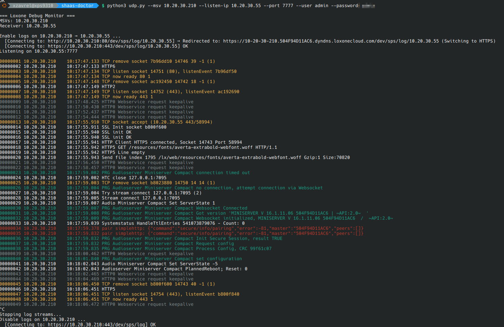

# Loxone UDP Debug Monitor

A Python utility for capturing and displaying real-time debug UDP logs from a Loxone Miniserver. It automatically connects to the Miniserver via HTTP(S) to enable the UDP log stream to your machine, formats and colorizes incoming logs for readability, and gracefully disables the stream when explicitly stopped with `Ctrl+C`.

## Features
- **Auto-Discovery of HTTPS**: Automatically follows HTTP → HTTPS redirects.
- **Auto-Discovery of Local IP**: Automatically detects the best local IP to receive the logs on.
- **Log Formatting**: Cleans up binary log data and highlights important log prefixes (PRG, LNK, TCP, DNS, errors, and keepalives).
- **Multiple Miniservers**: Easily receive logs from multiple miniservers simultaneously by providing a comma-separated list of IPs.

## Requirements
- Python 3.6+
- `requests` library (`pip install requests`)

## Usage

```bash
python udp.py --msv <loxone_ip>
```
*Note: You may substitute `python` with `python3` or `./udp.py` depending on your environment.*

### Options
- `--msv`: **(Required)** Comma-separated list of Miniserver IPs/hostnames (e.g. `192.168.1.100,10.20.30.210`).
- `--listen-ip`: Local IP address bindings for receiving logs. Will be auto-detected if omitted.
- `--port`: UDP port to listen on. Default: `7777`.
- `--user`: Miniserver username. Either provide this flag or set the `LOX_USER` environment variable. Default: `admin`.
- `--password`: Miniserver password. Either provide this flag or set the `LOX_PASS` environment variable. Default: `password`.
- `--https`: Explicitly use HTTPS. *(The script will automatically detect standard redirects to HTTPS even without this flag).*
- `--raw`: Run in raw mode to output a hexdump of the raw incoming UDP packets.
- `--logfile`: Path to a file to append the raw received lines to.

### Environment Variables
You can omit `--user` and `--password` parameters by setting the following system environment variables:
- `LOX_USER`: Username for API authentication
- `LOX_PASS`: Password for API authentication

### Example
```bash
$ LOX_PASS=mySecretPassword python udp.py --msv 10.20.30.210
```


> [!WARNING]
> **Important Connectivity Requirements**
> 
> Due to the nature of UDP logging, the following network conditions must be met:
> 1. **Firewall Requirements:** The UDP port specified (default: `7777`) **must be allowed/open** on your local machine's firewall for incoming UDP traffic.
> 2. **Network Reachability:** The local IP address (`listen-ip`) the script is bound to **must be routable and reachable** from the Miniserver. If you are behind NAT or a VPN, ensure the Miniserver can correctly route UDP packets back to the detected IP address.
